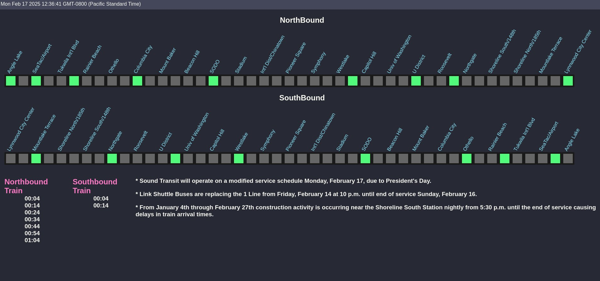

# st-lightRail-map

This is a side project insipred by https://github.com/waldenhillegass/link-map. This is a dispaly of the Link light rail transit system using stuff I learned from project odin to display on to a monitor using a raspberry pi.

# setup
Before you begin, you need to get a api key from sountrasit. https://www.soundtransit.org/help-contacts/business-information/open-transit-data-otd has the information to request a API key. 
Once you obtain a api key you then need to make a .env file in root and fill it with your API key. example line "API_KEY=YOUR_API_KEY_GOES_HERE".

# to run
1. install node (I used nvm, lts)
2. npm install express
3. npm start
4. open browser to "localhost:1234"

# example

# testing pdoman
1. sudo apt-get upgrade
2. sudo apt-get upgrade
3. sudo apt install docker.io
4. docker build -t st-lightrail-map .
5. sudo docker run -d -p 1234:1234 st-light-rail 